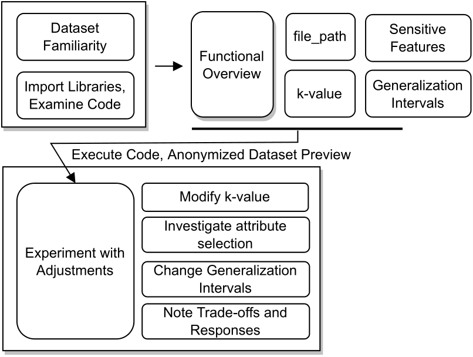

# Workshop Description: Learning Scenario 01 - Fundamental Approach and Attributes of k-anonymity**

In this workshop, participants will dive into the essential concepts and attributes of k-anonymity, a fundamental technique in data privacy and protection. Through a hands-on and interactive approach, participants will gain an in-depth understanding of the implementation details of the `k_anonymize` function and its associated attributes. By working with real datasets, experimenting with code, and exploring various scenarios, attendees will develop practical skills in applying k-anonymity to protect sensitive information while maintaining data utility.

**Duration:** 3 hours

**Target Audience:** Data analysts, data scientists, privacy professionals, and anyone interested in understanding and implementing k-anonymity techniques.

**Prerequisites:** Basic understanding of Python programming and data manipulation concepts.

**Agenda:**

1.  **Introduction to k-Anonymity (30 mins)**
    
    -   Overview of data privacy and the need for k-anonymity.
    -   Explanation of quasi-identifiers and their role in privacy protection.
2.  **Understanding the `k_anonymize` Function (45 mins)**
    
    -   Reading dataset descriptions and understanding data structures.
    -   Exploring code snippets and documentation related to the `k_anonymize` function.
    -   Discussing the underlying logic and concepts behind the function.
3.  **Hands-on Implementation (60 mins)**
    
    -   Guided exercise: Implementing the `k_anonymize` function on sample datasets.
    -   Experimenting with different values of the `k` parameter to observe the trade-off between privacy and information loss.
    -   Identifying quasi-identifiers within datasets and specifying them using the `quasi-identifiers` attribute.
4.  **Customization and Optional Functionalities (45 mins)**
    
    -   Introducing the concept of `generalization_intervals` for attribute customization.
    -   Experimenting with varying `generalization_intervals` to understand their impact on k-anonymity and data utility.
5.  **Real-world Application and Best Practices (30 mins)**
    
    -   Case study: Applying k-anonymity to a real-world dataset.
    -   Discussion on challenges and best practices in achieving effective k-anonymity.
6.  **Q&A and Open Discussion (15 mins)**
    
    -   Addressing participants' questions and concerns.
    -   Encouraging participants to share their insights and experiences.

**Key Takeaways:**

-   Understanding the `k_anonymize` function and its attributes.
-   Proficiency in loading diverse datasets for anonymization.
-   Observing the balance between privacy preservation and information loss through the `k` attribute.
-   Identifying and specifying quasi-identifiers for enhanced privacy control.
-   Customizing generalization intervals for tailored privacy protection.
-   Applying k-anonymity techniques to real-world scenarios.

By the end of this workshop, participants will have gained practical knowledge and skills to confidently implement k-anonymity techniques in their own projects and contribute to ensuring data privacy and security.

# Example Workflow

**Introduction:** In this educational scenario, we will extensively explore the inner workings of the `k_anonymize` function, a tool crucial for achieving k-Anonymity in datasets. Our focus will be on comprehending the function's attributes, its underlying logic, and its pivotal role in maintaining privacy while preserving data utility.

**Step 1: Dataset Familiarization:** Commence by thoroughly understanding the dataset's description. This initial step is crucial for grasping the data's structure and identifying quasi-identifiers—attributes that could potentially reveal individual identities.

**Step 2: Understanding the `k_anonymize` Function:** Import the necessary libraries (csv, numpy, matplotlib.pyplot). Examine the provided code sections that pertain to the `microaggregate` and `k_anonymize` functions. Develop a clear understanding of each function's purpose and their collective contributions towards achieving k-Anonymity.

**Step 3: Scrutinizing `k_anonymize` Function Attributes:** Dive into the attributes of the `k_anonymize` function:

-   `file_path`: Path leading to the CSV dataset.
-   `k`: Desired k-Anonymity level.
-   `sensitive_features`: List of attributes necessitating protection.
-   `generalization_intervals`: Optional dictionary for customized generalization levels. Delve into the role of each attribute and their impact on the anonymization process.

**Step 4: Practical Implementation:** Execute the provided code within the notebook. Witness the code in action by modifying attribute values. Analyze the anonymized datasets generated and the proportion of anonymized rows.

**Step 5: Experimentation and Customization:** Experiment with attribute adjustments to explore diverse scenarios:

-   Modify `k` to observe its effects on anonymity.
-   Investigate different combinations of `sensitive_features` to discern their individual significance.
-   Customize `generalization_intervals` to fine-tune the degree of attribute generalization.
-   Take note of the trade-off between ensuring privacy and retaining data utility across various scenarios.

**Conclusion:** Through this interactive learning experience, you've gained an in-depth understanding of implementing k-Anonymity using the `k_anonymize` function. You've delved into its attributes, experimented with various scenarios, and comprehended the outcomes. Armed with this knowledge, you are now well-prepared to effectively apply k-Anonymity in real-world contexts, strategically balancing privacy preservation with data utility.
