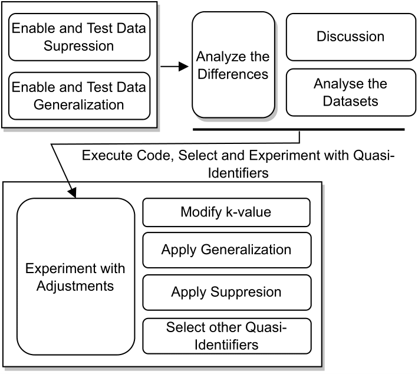

# Workshop Description: Learning Scenario 03: Generalization Intervals and Attribute Selection**

In this workshop, participants will gain a deep understanding of the critical role that attribute selection plays in the effectiveness of k-anonymity techniques. Through hands-on experimentation and analysis, attendees will explore the impact of various quasi-identifiers and `k` values on the anonymization process. By altering the arguments of the k-anonymity function, participants will uncover insights into how attribute selection influences privacy preservation and the overall success of anonymization.

**Duration:** 2 hours

**Target Audience:** Data analysts, data scientists, privacy professionals, and individuals seeking to enhance their knowledge of k-anonymity and attribute selection.

**Prerequisites:** Familiarity with k-anonymity concepts and basic understanding of Python programming.

**Agenda:**

1.  **Introduction to Attribute Selection (15 mins)**
    
    -   Overview of the importance of selecting relevant quasi-identifiers.
    -   Discussion on the impact of attribute selection on k-anonymity outcomes.
2.  **Modifying Quasi-Identifiers (30 mins)**
    
    -   Exploring the concept of quasi-identifiers and their significance.
    -   Hands-on exercise: Experimenting with different combinations of quasi-identifiers.
    -   Analyzing the anonymized datasets resulting from various configurations.
3.  **Varying the `k` Value (30 mins)**
    
    -   Guided experiment: Adjusting `k` values in conjunction with different quasi-identifiers.
    -   Observing the changes in achieved anonymity and data utility.
4.  **Analyzing Anonymized Datasets (30 mins)**
    
    -   Group activity: Comparing anonymized datasets to identify differences in effectiveness.
    -   Discussion on the relationship between attribute selection, `k` values, and anonymization outcomes.
5.  **Understanding Practical Implications (15 mins)**
    
    -   Reflecting on the observed differences in privacy and utility across configurations.
    -   Discussing how the insights gained can inform decision-making in real-world scenarios.
6.  **Q&A and Discussion (15 mins)**
    
    -   Addressing participant questions and facilitating open discussion.
    -   Encouraging participants to share their experiences and observations.

**Key Takeaways:**

-   Understanding the critical role of attribute selection in k-anonymity.
-   Evaluating the impact of different quasi-identifiers on anonymization effectiveness.
-   Observing the relationship between varying `k` values and achieved anonymity.
-   Developing insights into the balance between privacy preservation and data utility.
-   Equipping participants to make informed decisions when selecting quasi-identifiers for real-world k-anonymity implementations.

By the end of this workshop, participants will have acquired a practical understanding of how the selection of relevant quasi-identifiers significantly influences the success of the anonymization process. They will be better prepared to navigate the challenges of real-world scenarios, where informed decisions regarding attribute selection can make a substantial difference in achieving effective k-anonymity while preserving data utility.

# Example Workflow

## Introduction
In this learning scenario, we will highlight the significance of attribute selection in the k-Anonymity process. Participants will experiment with changing the quasi-identifiers and varying the value of "k". By modifying the k-anonymity function's arguments, we will gain insights into how different attributes impact the effectiveness of k-anonymity and the preservation of privacy. The anonymization procedure will be executed with various combinations of quasi-identifiers and "k" values. We will then analyze the resulting anonymized file to assess the achieved effectiveness for each configuration. By comparing the anonymized datasets, we can observe differences in the level of anonymity and the utility of the data.

## Step 1: Changing Quasi-Identifiers and Varying "k" Values
- Modify the k-anonymity function's arguments to experiment with different quasi-identifiers and "k" values.
- Execute the k-anonymity procedure for various attribute combinations.
- Observe how changes in quasi-identifiers and "k" values impact the level of achieved anonymity and data utility.

## Step 2: Analyzing the Results
- Analyze the outputs from the previous step to understand the impact of attribute selection and "k" values.
- Compare the achieved effectiveness for different configurations in terms of anonymity and data utility.
- Observe how the inclusion or exclusion of certain quasi-identifiers influences the anonymization process.

## Step 3: Making Informed Decisions
- Discuss the practical implications of attribute selection on the effectiveness of k-anonymity.
- Highlight the importance of selecting relevant quasi-identifiers to achieve a balance between privacy and data utility.

## Conclusion
Through this interactive learning scenario, participants gain practical insights into the importance of attribute selection in the k-Anonymity process. By experimenting with different quasi-identifiers and "k" values, participants can observe the impact on the achieved level of anonymity and data utility. This understanding equips participants with the skills to make informed decisions when implementing k-anonymity in real-world scenarios. Selecting appropriate quasi-identifiers is crucial to strike a balance between privacy preservation and data utility.
